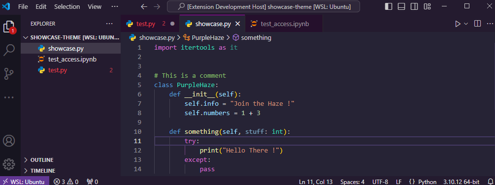

# Modern Purple Raze README

A Purple theme that takes inspiration from Default Dark Modern syntax highlights and Synthwave 84 purple tones.

I basically use the non-neon version base colors from Synthwave 84 with code syntax colors from the default Dark Modern VSCode Theme. Additionally, I made some all-around tweaks to improve overall visibility.

